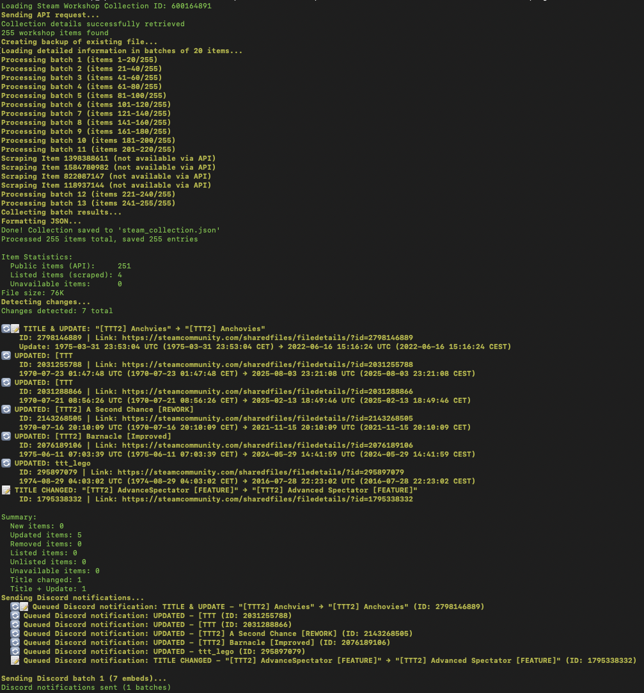

# Steam Workshop Collection Notifier to Discord

A powerful Bash script that monitors Steam Workshop Collections for changes and sends notifications to Discord webhooks. The script tracks item additions, removals, updates, title changes, availability status, and more.


## 📸 Screenshots

### Discord Notifications


### Console Output


‚## ✨ Features

- **Comprehensive Monitoring**: Tracks all changes in Steam Workshop Collections
- **Smart Change Detection**: Detects new items, removals, updates, title changes, and availability status
- **Discord Integration**: Sends rich embed notifications to Discord channels
- **Fallback Scraping**: Automatically scrapes workshop pages when Steam API fails
- **Batch Processing**: Efficiently processes large collections using parallel requests
- **Data Persistence**: Maintains historical data to track changes over time
- **Flexible Configuration**: Customizable batch sizes, timeouts, and notification settings

## 📋 Change Types Detected

- 📦 **New Items**: Items added to the collection
- ❌ **Removed Items**: Items removed from the collection
- ✅ **Listed Items**: Previously unavailable items that became publicly accessible
- 🔒 **Unlisted Items**: Items that became private or unlisted
- 💀 **Unavailable Items**: Items that became completely inaccessible
- 🔄 **Updated Items**: Items with content updates (timestamp changes)
- 📝 **Title Changed**: Items with modified titles
- 🔄📝 **Title & Update**: Items with both title and content changes

## 🔧 Requirements

### System Requirements
- **Bash**: Version 5.0 or higher
- **curl**: For API requests and web scraping
- **jq**: For JSON processing (recommended but optional)
- **GNU date**: For timestamp processing

### Platform Support
- ✅ Linux (all distributions)
- ✅ macOS (with Homebrew)
- ⚠️ Windows (via WSL or Git Bash)

## 📥 Installation

### Linux (Ubuntu/Debian)
```bash
# Install dependencies
sudo apt update
sudo apt install curl jq

# Clone the repository
git clone https://github.com/xopez/steam-workshop-collection-discord-notifier.git
cd steam-workshop-collection-discord-notifier

# Make the script executable
chmod +x workshop_updates.sh
```

### macOS
```bash
# Install dependencies via Homebrew
brew install curl jq

# Clone the repository
git clone https://github.com/xopez/steam-workshop-collection-discord-notifier.git
cd steam-workshop-collection-discord-notifier

# Make the script executable
chmod +x workshop_updates.sh
```

### Windows (WSL)
```bash
# Enable WSL and install Ubuntu
# Then follow Linux installation steps
```

## 🚀 Usage

### Basic Usage
```bash
# Monitor a collection (basic)
./workshop_updates.sh -c 123456789

# Monitor with custom output file
./workshop_updates.sh -c 123456789 -o my_collection.json

# Monitor with Discord notifications
./workshop_updates.sh -c 123456789 -w "https://discord.com/api/webhooks/YOUR_WEBHOOK_URL"

# Monitor with custom batch size
./workshop_updates.sh -c 123456789 -b 30
```

### Command Line Options
```
-c COLLECTION_ID    Steam Workshop Collection ID (required)
-o OUTPUT_FILE      Output JSON file (default: steam_collection.json)
-b BATCH_SIZE       Batch size for API requests (default: 20, max: 50)
-w WEBHOOK_URL      Discord webhook URL for notifications (optional)
-h                  Show help message
```

### Finding Your Collection ID

1. Go to your Steam Workshop Collection in a web browser
2. Look at the URL: `https://steamcommunity.com/sharedfiles/filedetails/?id=COLLECTION_ID`
3. The number after `id=` is your Collection ID

Example: `https://steamcommunity.com/sharedfiles/filedetails/?id=2845754265`
Collection ID: `2845754265`

## 🔧 Discord Webhook Setup

### Creating a Discord Webhook

1. **Open Discord** and go to your server
2. **Right-click** on the channel where you want notifications
3. **Select** "Edit Channel" → "Integrations" → "Webhooks"
4. **Click** "New Webhook"
5. **Customize** the webhook name and avatar
6. **Copy** the webhook URL
7. **Use** the URL with the `-w` parameter

### Webhook URL Format
```
https://discord.com/api/webhooks/WEBHOOK_ID/WEBHOOK_TOKEN
```

### Testing Discord Integration
```bash
# Test with a small collection first
./workshop_updates.sh -c 123456789 -w "YOUR_WEBHOOK_URL" -b 10
```

## ⚙️ Configuration

### Environment Variables
You can set default values using environment variables:

```bash
export STEAM_COLLECTION_ID="123456789"
export DISCORD_WEBHOOK_URL="https://discord.com/api/webhooks/..."
export BATCH_SIZE="25"
export CURL_TIMEOUT="45"
```

## 📊 Output Format

### JSON Structure
The script generates a JSON file with the following structure:

```json
{
  "collection_id": "123456789",
  "collection_name": "My Awesome Collection",
  "timestamp": "2024-01-15T10:30:45+00:00",
  "item_count": 150,
  "items": [
    {
      "publishedfileid": "987654321",
      "time_updated": 1705315845,
      "title": "Awesome Mod v2.1",
      "result": 1,
      "data_source": "api",
      "preview_url": "https://steamuserimages-a.akamaihd.net/..."
    }
  ]
}
```

### Data Source Types
- **api**: Data retrieved from Steam API (publicly available)
- **scraped**: Data obtained via web scraping (private/unlisted items)
- **unavailable**: Item is completely inaccessible

### Console Output
```
Loading Steam Workshop Collection ID: 123456789
Sending API request...
Collection details successfully retrieved: "My Collection"
150 workshop items found
Creating backup of existing file...
Loading detailed information in batches of 20 items...
Processing batch 1 (items 1-20/150)
Processing batch 2 (items 21-40/150)
...
Collecting batch results...
Done! Collection saved to 'steam_collection.json'
Processed 150 items total, saved 150 entries

Item Statistics:
  Public items (API):     120
  Listed items (scraped): 25
  Unavailable items:      5
File size: 245K

Detecting changes...
Changes detected: 3 total

📦 NEW: New Awesome Mod
    ID: 123456789 | Link: https://steamcommunity.com/sharedfiles/filedetails/?id=123456789
🔄 UPDATED: Updated Mod
    ID: 987654321 | Link: https://steamcommunity.com/sharedfiles/filedetails/?id=987654321
    2024-01-14 15:30:22 UTC → 2024-01-15 10:30:45 UTC

Summary:
  New items: 1
  Updated items: 1
  Removed items: 0
  Listed items: 0
  Unlisted items: 0
  Unavailable items: 0
  Title changed: 0
  Title + Update: 1
```

## 🔄 Automation

### Cron Job Setup
To run the script automatically at regular intervals:

```bash
# Edit crontab
crontab -e

# Add entries (examples)
# Check every 30 minutes
*/30 * * * * /path/to/workshop_updates.sh -c 123456789 -w "WEBHOOK_URL" >> /var/log/steam_monitor.log 2>&1

# Check every hour
0 * * * * /path/to/workshop_updates.sh -c 123456789 -w "WEBHOOK_URL"

# Check daily at 9 AM
0 9 * * * /path/to/workshop_updates.sh -c 123456789 -w "WEBHOOK_URL"
```

### Systemd Service (Linux)
Create a systemd service for better management:

```bash
# Create service file
sudo nano /etc/systemd/system/steam-workshop-monitor.service
```

```ini
[Unit]
Description=Steam Workshop Collection Monitor
After=network.target

[Service]
Type=oneshot
User=your-username
WorkingDirectory=/path/to/script
ExecStart=/path/to/workshop_updates.sh -c 123456789 -w "WEBHOOK_URL"
StandardOutput=journal
StandardError=journal

[Install]
WantedBy=multi-user.target
```

```bash
# Create timer file
sudo nano /etc/systemd/system/steam-workshop-monitor.timer
```

```ini
[Unit]
Description=Run Steam Workshop Monitor every 30 minutes
Requires=steam-workshop-monitor.service

[Timer]
OnCalendar=*:0/30
Persistent=true

[Install]
WantedBy=timers.target
```

```bash
# Enable and start
sudo systemctl daemon-reload
sudo systemctl enable steam-workshop-monitor.timer
sudo systemctl start steam-workshop-monitor.timer
```

## 🐛 Troubleshooting

### Common Issues

#### "Collection ID is required"
**Problem**: Missing or invalid collection ID
**Solution**:
```bash
# Ensure you provide a valid numeric collection ID
./workshop_updates.sh -c 123456789
```

#### "Collection not found"
**Problem**: Invalid collection ID or private collection
**Solutions**:
- Verify the collection ID is correct
- Ensure the collection is public or accessible
- Check if the collection owner hasn't deleted it

#### "curl is not installed"
**Problem**: Missing curl dependency
**Solutions**:
```bash
# Ubuntu/Debian
sudo apt install curl

# macOS
brew install curl

# CentOS/RHEL/Fedora
sudo yum install curl  # or dnf install curl
```

#### "jq is not installed"
**Problem**: Missing jq for JSON processing
**Note**: The script works without jq but JSON won't be formatted
**Solutions**:
```bash
# Ubuntu/Debian
sudo apt install jq

# macOS
brew install jq

# CentOS/RHEL/Fedora
sudo yum install jq  # or dnf install jq
```

#### Discord notifications not working
**Problem**: Invalid webhook URL or Discord server issues
**Solutions**:
- Verify webhook URL is correct and complete
- Test webhook URL manually with curl:
```bash
curl -H "Content-Type: application/json" \
     -d '{"content": "Test message"}' \
     "YOUR_WEBHOOK_URL"
```
- Check Discord server permissions
- Ensure the channel still exists

#### "Steam API is unreachable"
**Problem**: Network connectivity or Steam API issues
**Solutions**:
- Check internet connection
- Try again later (Steam API might be temporarily down)
- Use a VPN if your region blocks Steam
- Increase timeout with custom CURL_TIMEOUT

#### Rate limiting / Too many requests
**Problem**: Making requests too quickly
**Solutions**:
- Reduce batch size using `-b` parameter
- Add delays between script runs
- Try running during off-peak hours

### Debug Mode
Enable debug output by modifying the script:

```bash
# Add at the top of the script after the shebang
set -x  # Enable debug mode
```

### Verbose Output
For more detailed output:

```bash
# Run with verbose curl
./workshop_updates.sh -c 123456789 2>&1 | tee debug.log
```

### Log Analysis
Check system logs for errors:

```bash
# Check cron logs
grep CRON /var/log/syslog

# Check systemd service logs
journalctl -u steam-workshop-monitor.service

# Check systemd timer logs
journalctl -u steam-workshop-monitor.timer
```

## 📈 Performance Optimization

### For Large Collections (1000+ items)
```bash
# Increase batch size
./workshop_updates.sh -c 123456789 -b 50
```

### For Small Collections (<100 items)
```bash
# Smaller batch size for faster initial response
./workshop_updates.sh -c 123456789 -b 10
```

## 🔒 Security Considerations

### Webhook URL Security
- **Never commit** webhook URLs to version control
- **Use environment variables** for webhook URLs
- **Rotate webhook URLs** periodically
- **Limit webhook permissions** to specific channels

### File Permissions
```bash
# Secure script permissions
chmod 750 workshop_updates.sh

# Secure output files
chmod 640 steam_collection.json
chmod 640 steam_collection.json.old
```

### Network Security
- The script only makes outbound HTTP requests
- No sensitive data is transmitted except to Discord
- Steam API requests are read-only

## 🤝 Contributing

### Bug Reports
Please include:
- Operating system and version
- Bash version (`bash --version`)
- Full error message
- Steps to reproduce
- Collection ID (if safe to share)

### Feature Requests
- Describe the use case
- Explain expected behavior
- Provide examples if applicable

### Pull Requests
1. Fork the repository
2. Create a feature branch
3. Make your changes
4. Test thoroughly
5. Submit a pull request

## 📜 License

This project is licensed under the MIT License - see the [LICENSE](LICENSE) file for details.

## 🙏 Acknowledgments

- Steam Community for the Workshop API
- Discord for webhook functionality
- The open-source community for tools and inspiration

## 📞 Support

- **GitHub Issues**: For bugs and feature requests
- **Discussions**: For questions and community support

---

**Made with ❤️ for the Steam Workshop community**
